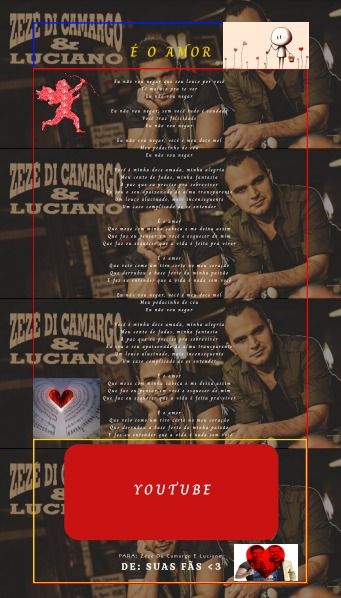
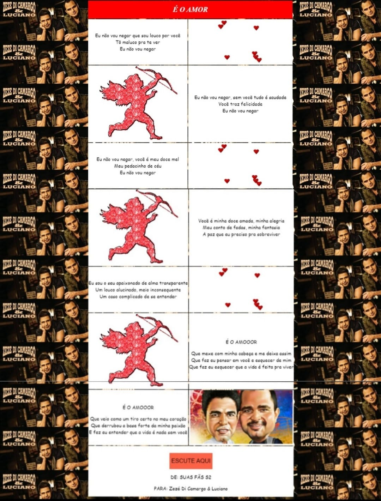

# É o amoooor ❤️
## Sobre o projeto
Esta é uma atividade proposta pelo professor Jefferson Chaves para a disciplina de tópicos especiais em informática. Ela tem como objetivo tranformar um clássico da música sertaneja em uma página html.

### Protótipo do site
Para nos auxiliar a desenvolver nosso site nós criamos inicialmente um prótotipo no qual nos baseamos para chegar à versão final.

Protótipo do site:

Versão final:

## Desenvolvedoras 
Este projeto foi desenvolvido pelas alunas Alana Brandão, Maria Eduarda O. Becker, Maria Eduarda Heck e Nicolly Tavassi do curso Técnico em Informática Integrado ao Ensino Médio do Instituto Federal do Paraná.